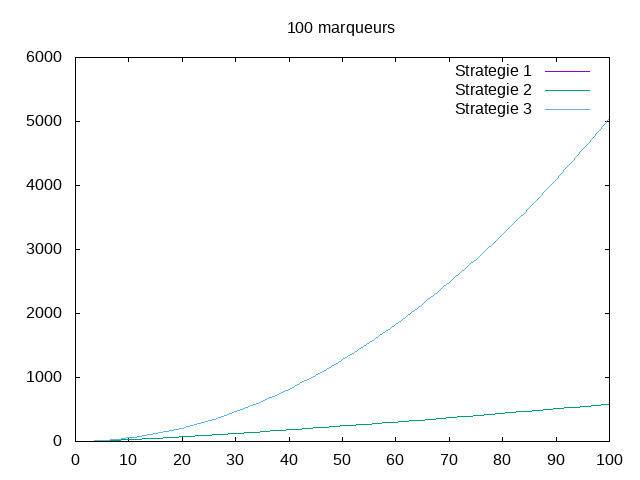

---------------
Experimentateur
---------------

.. toctree::
   :maxdepth: 1

   experience.rst
   marker.rst
   
~~~~~~~~~~
Etat du TP
~~~~~~~~~~

~~~~~~~~~~~~~~~~~~~~~~
Réponses aux questions
~~~~~~~~~~~~~~~~~~~~~~

1.2.2

Pour étudier la complexité de cet algorithme , l'opération que nous pouvons compter et le nombre d'utilisation de la fonction compare.

1.2.3

Cet algorithme sors de la boucle de comparaison lorsque le marquer recherché a été trouvé dans la liste positive. Ainsi le pire de cas et celui ou aucun des marqueurs ne se trouve dans la liste positive.

1.2.4

Si on a m la longeur de la liste de marqueur et p la longeur de la liste de positif, alors dans le pire de cas le nombre d'occurence de OP et m*p.

1.3.2

Le pire des cas est celui ou aucun des marqueurs ne se trouve dans la liste positive
dans le pire des cas, le nombre de comparaison sera de m*log2(p)

1.4.2 

Le pire des cas est celui ou aucun des marqueurs ne se trouve dans la liste positive. Dans ce cas, le nombre de comparaison sera de m*p

1.5.2

Peut importe la stratégie, l'exemplaire du probleme ou elle seront toutes le plus efficace et le cas ou m = 1 et p = 1 car seule une opération sera effectuée
on constate que dans ce cas les trois stratégie effectue le même nombre d'opération.
on peut même noter que peut impore la valeur de m, si p est égale a 1 les trois stratégie effecturons toujours m opérations correspondant à un parcours de la liste m

1.5.6

.. image:: ../out/10.png
.. image:: ../out/20.png

.. image:: ../out/40.png

.. image:: ../out/60.png

.. image:: ../out/80.png

On remarque que dans le pire des cas, le comportement de la stratégie 3 est le même que celui de la stratégie 1. Ainsi, le fait de trier les deux listes ne permet pas une recherche plus efficace que le tri d'une seule liste avec la recherche dichotomique. 
On note cependant qu'en dehors du pire des cas, la stratégie 3 est plus efficace que la stratégie 1.
On peut dire que la stratégie 1 et 3 sont en O(n) est la stratégie 2 en O(log(n)).

