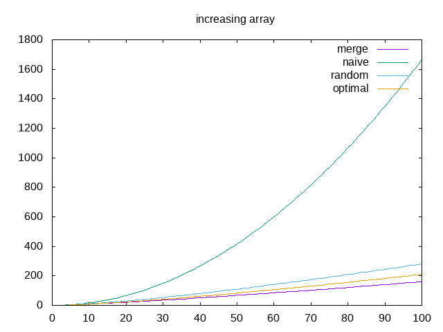
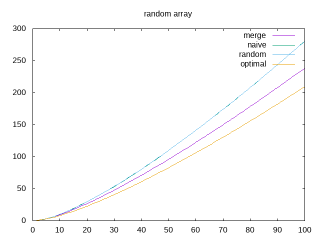

---------
Quicksort
---------

.. toctree::
   :maxdepth: 1

   modules.rst

~~~~~~~~~~
Etat du TP
~~~~~~~~~~

TP terminé

~~~~~~~~~~
Réponses aux questions
~~~~~~~~~~

Indiquez ici les réponses aux questions posées dans le TP. Vous
reprendrez le numéro de la section et le numéro de la question. Par
exemple pour répondre à la question 3 de la section 2.4 vous
indiquerez.

   
Question 1.1
--------------

Le tri bulle, le tri par tas, le tri par intersection et le tri par sélection sont des exemples
de tris sur place.

Question 1.3
--------------

La propriété qui garantie que la partionement est réalisé correctement est que le pivot doit se trouver entre la borne droite de la première tranche et la borne gauche de la deuxième tranche sans pour autant être dans aucune des deux.

Question 1.9
-------------

En plus de l'espace utlisé pour stocker le tableau de base, on utilise 8 variables pour les bornes de chaque partition et les échanges de positions dans le tableau

Question 2.4
-------------

On remarque que pour un petit nombre de valeurs le tri fusion et le tri rapide (pivot naif ou aléatoire) effectue le même nombre d'opérations mais pour un nombre de valeurs plus grand, le tri fusion est plus efficace

Question 2.5
-------------

Le tri fusion est plus rapide que le tri rapide (pivot naif ou aléatoire) mais utilise plus de mémoire car il crée un chaque fois un nouveau tableau.

Question 2.6
------------
On remarque une très grande différence au niveau du quicksort naif ceci s'explique car celui-ci prend la valeur la plus à gauche du tableau est dans le cas ou le tableau est trié, la valeur du pivot est la plus petite valeur du tableau, forcant une compraison pour tout les elements à chaque fois (le pire de cas)

Question 2.7
------------
Le pire choix de pivot pour quicksort est donc celui ou la valeur du pivot est la plus petite du tableau à trier
dans le pire des cas : complexité de quicksort = n^2

Question  3.1
-------------

La meilleure position du pivot est la mediane de la liste

Question 3.4
-------------

On notera que sur le graphique random , la courbe du quicksort naif n'est pas visible car confondue avec cell du quicksort random.

On remarque que dans le cas d'une liste déjà triée, le merge sort est le plus efficace, suivi par le quicksort optimal puis random et enfin le naif. Cependant le profil des courbes merge random et optimal sont similaire on peut donc conclure qu'ils ont une complexité similaire : nlog(n). 
Seul le pivot naif à une complexité différente de n^2

Dans le cas de la liste non triée
Le quicksort optimal est le plus efficace suivi de merge puis du random et du naif.
Or remarque que les courbes ont des profils similaires et donc que les fonctions ont une complexité similaire de nlog(n)

On peut conclure que le choix du pivot influe sur l'efficacité de l'algorithme de quicksort (surtout dans le pire des cas comme on le voit avec naive pour une liste triée), mais que dans la plupart des cas la complexité reste la même (par exemple entre random et optimal)

Question 3.5
------------

Complexité dans le meilleur des cas pour quicksort : nlog(n)

Question 4.1
------------

Si on prend en compte les comparaisons faites pour trouver le pivot optimal, avec la méthode que nous utilisons, alors quicksort optimal n'est pas le plus efficace.
 

